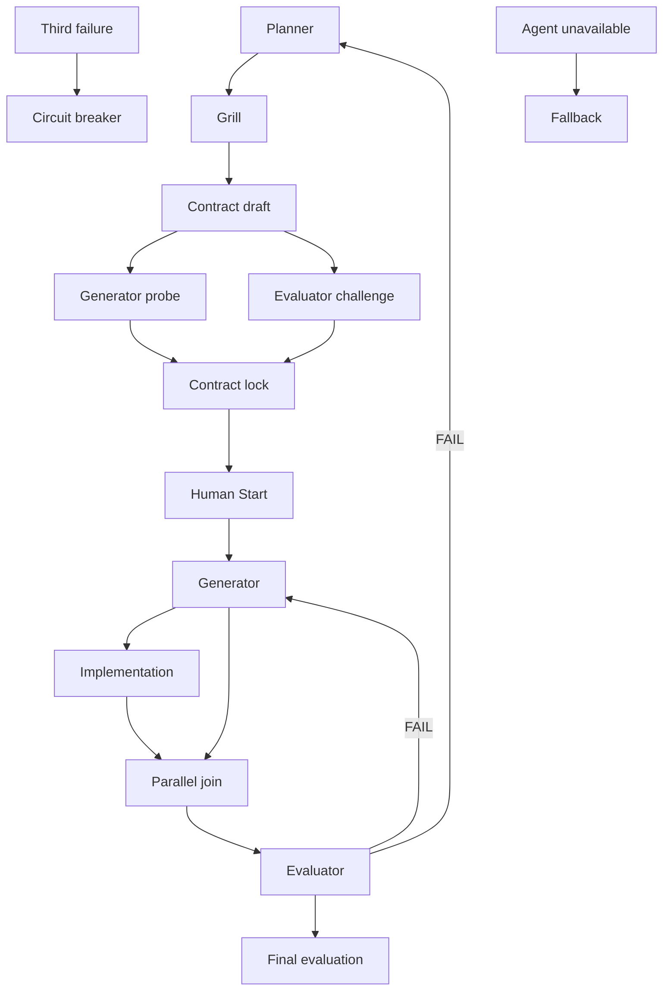

# PGE Protocol

> status: active
> owner: pge-protocol
> layer: profile
> Owns the Planner / Generator / Evaluator state machine, artifacts, and acceptance gates. Runtime orchestration belongs to `$pge-workflow`.

## Activation

Use PGE for medium+, critical-flow, public-interface, state/schema, cross-module, batch, or independently accepted work. Small local work may remain solo after Coding Start Check and still needs proportionate verification and review.

## Roles

- Planner owns facts, decisions, Contract revisions, slices, and Human Start recording.
- Generator implements only a locked, approved Contract and never edits the Contract or evaluation.
- Evaluator challenges the draft and later independently evaluates the integrated diff. It never fixes code or tests.
- Human owner resolves business choices, approves implementation for one Contract revision, and accepts any `PASS_WITH_NOTES` risk.

## Normative Flow

Pre-Challenge review does not require Human Start approval.

## Sprint Contract

`docs/pge/<sprint>-spec.md` records:

- goal, scope, acceptance criteria, non-goals, and implementation order;
- branch, fixed `Review base`, and candidate commit used for `git diff <base>...<candidate>`;
- approved behavior/test seams or the targeted verification boundary;
- first tracer bullet for behavior work, `verify_cmd`, risks, and circuit breaker;
- Grill closure, independent challenge, parallel slices, fallback, and Human Start state.

The Contract binds behavior and evidence, not an unnecessary helper, interface, or abstraction shape. Scope changes return to Planner and increment `contract_revision`.

Final evaluation starts from a clean candidate commit. `git status --short` must show no staged or unstaged in-scope production/test/document change, and every untracked path must be classified. Dirty implementation bytes are not covered by `git diff <base>...<candidate>` and therefore block evaluation.

## Human Start

Implementation starts only when all statements are true:

approved_contract_revision == contract_revision
channel != ""
evidence != ""

The gate also requires `status == "approved"`. A locked Contract, Grill confirmation, silence, fallback, or approval for an older revision is insufficient.

## Required Agent Context

Standalone `@path` entries in Agent prompts are a Harness convention, not a native Codex include. Before dispatch, require the Agent to read each referenced file directly. The required sources are `harness/coding-style.md` and `harness/code-shape.md`; the locked Contract and relevant owners remain discoverable through `AGENTS.md`.

## Generator

- Pre-contract mode returns only an implementation probe; it does not edit.
- Implementation mode verifies Human Start, branch/worktree, scope, and required context.
- Behavior work invokes `$tdd`. Contract-approved seams satisfy the Skill's user-confirmation requirement; ask again only when the Contract leaves a behavior choice unresolved.
- Non-behavior work uses the Contract's targeted verification plan without manufacturing RED/GREEN ceremony.
- After all relevant behavior tests are GREEN, perform an author Review against the injected standards. Refactor only a concrete current-change finding, then rerun affected verification.
- Return changed scope, test/verification evidence, triggered schemas, `verify_cmd`, and residual risk.

## Evaluator

Challenge mode checks whether the draft is testable, complete, independently decidable, and free of unjustified implementation shape.

Evaluation mode:

1. Validate Human Start, required context, Contract revision, fixed Review base, clean candidate commit, and classified untracked paths.
2. Read the complete production diff and freeze **Standards** findings before tests or Generator rationale.
3. Check **Spec** separately for missing/incorrect behavior and scope creep.
4. Read tests and verification evidence, inspect integration/document risks, and apply `harness/code-review.md` severity.
5. Return exactly `PASS`, `PASS_WITH_NOTES`, or `FAIL`; unresolved Critical or Major findings require `FAIL`.

## Parallel And Fallback

Parallel code work requires independently acceptable slices, disjoint files, separate branches/worktrees, and slice-level `verify_cmd`. Shared public interfaces, schemas, state machines, migrations, generated files, or helper hot zones remain serial. The Planner owns integration and final verification.

If a required Agent is unavailable, record roles collapsed, guarantees lost, mitigations, restore condition, self-review state, owner acknowledgement state, and independent Evaluator assurance. Fallback never bypasses Human Start and never presents a generic reviewer as the missing Evaluator.

## Circuit Breaker

After three failures on the same interface or flow, stop patching. Record evidence and recovery conditions, then return to Planner or the owner. `FAIL` blocks close; `PASS_WITH_NOTES` closes only after explicit owner acceptance.
