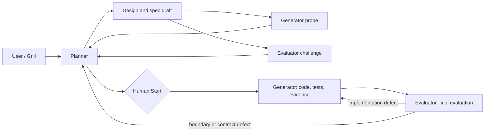

# PGE Protocol

> status: active
> owner: large-work-protocol
> layer: profile
> This file owns Planner / Generator / Evaluator workflow; it does not replace the main workflow in `AGENTS.md`.

Use `$pge-workflow` as the PGE routing, Grill, Challenge Gate, Human Start, fallback, and parallel-dispatch entrypoint. This file remains the policy source of truth.

## Activation

Use PGE by default for:

- medium / large tasks;
- critical user-data or public-interface behavior;
- multi-module changes;
- batch work, migrations, or repeated failure;
- work that needs independent validation to be trusted.

Small docs/config/single-module changes may stay solo, but still need scoped verification and review.

## Roles

| Role | Responsibility | Output |
|---|---|---|
| Planner | Define and adjudicate the behavior boundary and execution plan | design/spec/status documents |
| Generator | Choose the smallest implementation inside that boundary | code, tests, `verify_cmd`, implementation evidence |
| Evaluator | Independently challenge the contract and validate the diff | `docs/pge/<sprint>-eval.md`, `PASS`, `PASS_WITH_NOTES`, or `FAIL` |



Planner is the single writer for design and spec documents; Evaluator is the single writer for the eval document. Generator writes its assigned code and tests and returns evidence. After Generator handoff, the main agent may fix an integration conflict or make a necessary correction; it must disclose the patch as an implementation change and include it in final verification and evaluation. Do not concurrently edit the same hot zone.

The final Evaluator is also the PGE task's independent AI code review: it checks contract compliance, code quality, tests, and residual risk. Do not dispatch a duplicate generic AI reviewer after normal PGE evaluation. During fallback, a generic AI reviewer may add clearly labeled supplemental findings, but cannot substitute for a missing Evaluator or restore its assurance. This AI gate does not replace human PR review when the repository requires it.

Project-level Codex agents live in:

- `.codex/agents/pge-generator.toml`
- `.codex/agents/pge-evaluator.toml`

If the runtime cannot spawn independent agents, record fallback. Do not silently collapse roles.

## Skill Relationship

- `.agents/skills/pge-workflow/SKILL.md` owns trigger discipline, Grill routing, Challenge Gate coordination, Human Start tool mapping, fallback status shape, parallel dispatch, and handoff prompts.
- `$grilling` is the model-invoked interview primitive. `$domain-modeling` may be added only for an explicitly chosen docs-bearing Grill with named planning-document write paths.
- `$grill-me` and `$grill-with-docs` are user-only entrypoints. PGE must not model-invoke either wrapper.
- This file owns the PGE policy, role boundaries, contract requirements, fallback rules, and circuit breaker.
- Project-level agents own execution and evaluation only when the runtime explicitly dispatches them.

## Sprint Contract

Each PGE task must define:

1. protocol version and current `contract_revision`;
2. Grill Closure: primitives used, user decisions, repository facts, assumptions, residual risks, and recommendation;
3. goal;
4. scope;
5. acceptance criteria;
6. non-goals;
7. implementation order;
8. first tracer bullet: the first failing test or smallest observable verification cut;
9. `verify_cmd`;
10. `human_start_gate` approval metadata;
11. fallback and restore condition when independent agents are unavailable.

Goal, scope, acceptance criteria, and non-goals lock the behavior boundary. A required property belongs to that boundary only when acceptance states it explicitly or a cited project hard rule requires it. Implementation order, tracer bullets, and `verify_cmd` are an execution projection that Planner may refine and write back to the current contract inside that boundary. The contract does not lock candidate helpers, Guards, function names, or other implementation shapes. A change to the behavior boundary returns to Planner for adjudication; an implementation-only simplification does not rewrite the contract.

Default templates:

- `docs/pge/spec.template.md`
- `docs/pge/eval.template.md`

When `scripts/check_pge_contracts.sh` exists, check the active spec before Challenge Gate and the eval draft before Evaluator acceptance. The script checks structure only; requirement quality, semantic drift, and acceptance sufficiency remain Challenge Gate / Evaluator responsibilities.

Existing protocol-v1 specs may receive text-only maintenance. Before implementation resumes, upgrade them to v2 with Grill Closure, `verify_cmd`, `contract_revision`, and Human Start evidence.

## Design / PGE Relationship

- `docs/design/*.md` is the long-lived map for cross-sprint background, route, boundaries, and hard decisions.
- `docs/pge/*-spec.md` is the per-sprint execution contract for goal, scope, acceptance, non-goals, order, and RED plan.
- `docs/pge/*-eval.md` is the per-sprint acceptance report for contract completion, verification commands, and residual risks.
- Create design first for large, cross-sprint, architectural, state-machine, or domain-boundary changes.
- Create a PGE spec for medium+, batch, single public-interface, or critical-flow work.
- One design may produce multiple independently acceptable PGE specs; design does not replace the PGE spec.

## Grill, Challenge, And Human Start

Every PGE task completes these steps in order:

1. Planner uses `$grilling` to pressure-test the decision tree and records Grill Closure. Repository-answerable facts are investigated; user decisions are asked one at a time.
2. Generator performs a read-only Implementation Probe and Evaluator performs a read-only Contract Challenge.
3. Planner adjudicates the findings and locks the Contract.
4. Planner projects the locked Contract as a visible Implement Plan and asks whether implementation may start.
5. Only an explicit approval for the current `contract_revision` passes Human Start.

Grill must cover or mark not applicable: behavior invariants; data/state; compatibility/rollback; failure/idempotency/concurrency; verification/observability; scope/non-goals. Confirmation that Grill reached shared understanding completes Grill Closure only. It does not approve implementation.

Before dispatching any Agent, announce its role, purpose, supplied context, and read/write boundary. Before Human Start, Agents may perform read-only research, Implementation Probe, and Contract Challenge. Planner may update only the current design, spec, status, and Challenge records. `$domain-modeling` may additionally write specifically named `CONTEXT.md` or ADR paths only when the user explicitly chose the docs-bearing route and those paths are recorded as planning outputs. Production code, tests, migrations, generated files, implementation branches/worktrees, and code-writing Agents remain forbidden.

Human Start metadata is valid only when all are true:

- PGE protocol version is `2`;
- `human_start_gate.status` is `approved`;
- `approved_contract_revision` equals `contract_revision`;
- `channel` and `evidence` are non-empty.

Silence, timeout, ordinary discussion, Grill confirmation, Contract lock, or approval for an older revision is not authorization. A change to goal, scope, acceptance criteria, non-goals, or an acceptance-required property increments `contract_revision` and revokes prior approval. Implementation-only simplification inside the same boundary does not. Fallback never bypasses Human Start.

## Parallel PGE

Multiple PGE specs under the same design may run in parallel only when the locked contract records slice boundaries, file boundaries, and independently decidable acceptance criteria.

Allowed:

- read-only research, Contract Challenge, and Evaluator checks;
- non-overlapping public-interface, package, or documentation slices;
- implementation slices that do not share generated files, migrations, protocol files, state machines, or shared helper hot zones.

Forbidden:

- same public interface, state machine, migration, or protocol file;
- competing edits to the same file hot zone or shared helper;
- unlocked contracts or acceptance that cannot be decided independently.

The main agent owns the design map, slice list, dispatch prompts, diff integration, conflict resolution, final `verify_cmd`, and Evaluator handoff. Parallel code-writing dispatch starts only after Human Start is valid for the current revision.

The baseline provides `scripts/check_pge_contracts.sh` as a structure checker. Hook, Make, or CI enablement remains a target-repository decision; do not write `.git/hooks/*` directly.

## Generator Protocol

- Pre-contract and pre-Human work is limited to an explicitly requested read-only Implementation Probe.
- Implementation starts only after the Contract is locked and Human Start is valid for its current revision.
- In pre-contract mode, do not edit production code or tests; output only the first tracer bullet, smallest implementation cut, required fake/mock, and expected verify command.
- Treat confirmed facts and cited security, authorization, and consistency hard rules as constraints on the contract, not lower-priority implementation preferences.
- If implementation reveals a new behavior boundary or required property, stop and return the evidence to Planner; do not silently expand the contract or tests.
- For behavior work, use TDD tracer bullets:
  - RED: write or identify one failing test and confirm the failure reason;
  - GREEN: implement the minimum code for that behavior;
  - REFACTOR: after the relevant verification is green, explicitly check for a concrete issue; no change is valid when none exists, and any refactor must preserve behavior and stay within the current change or goal.
- Do not write all tests first and all implementation later.
- Do not relax existing assertions, delete tests, or change acceptance criteria to pass.
- Keep changes inside the contract; return to Planner if scope expands.
- Do not add adjacent behavior for cleanliness, safety, or possible future needs without evidence inside the locked boundary.

## Evaluator Protocol

Evaluator is independent from implementation. It writes only the assigned eval report and does not edit production code or tests.

Apply `harness/code-review.md` during final evaluation and include a separate code-quality conclusion. Any critical code-review finding requires `FAIL`.

Check in this order:

1. protocol v2 Human Start evidence is complete and matches the current revision;
2. confirmed facts, goal, scope, non-goals, and diff necessity;
3. production behavior stayed inside the locked boundary;
4. contract compliance and tests not weakened;
5. TDD tracer bullet evidence where required;
6. user-data / API / migration safety;
7. code quality, minimality, and local style;
8. manual verification gaps and residual risks.

Any production behavior change outside the locked boundary requires `FAIL`. Judge helpers and interfaces by independent behavior or clarity value, not caller or implementation count alone. For state or concurrency code, review the call site for a clear object, state transition, and relevant ordering basis using the smallest necessary combination of names, branches, and comments.

Return exactly one conclusion:

- `PASS`: contract met, no blocker;
- `PASS_WITH_NOTES`: acceptable only after the owner explicitly accepts the residual risk;
- `FAIL`: blocker, key contract miss, weakened tests, or unsafe scope drift.

## Fallback

When independent Generator or Evaluator is unavailable, write:

```json
{
  "pge_fallback": {
    "enabled": true,
    "reason": "runtime cannot spawn independent PGE agent",
    "roles_collapsed": ["generator", "evaluator"],
    "lost_guarantees": ["context isolation", "implementation and acceptance perspective split"],
    "mitigations": ["declared main-agent checklist self-review", "human confirmation for critical acceptance", "record that independent Evaluator assurance is missing"],
    "restore_condition": "runtime exposes independent PGE agents or user authorizes subagents",
    "main_agent_self_review": "pending",
    "owner_ack_required": false,
    "owner_ack_status": "not_required",
    "independent_evaluator_assurance": "missing"
  }
}
```

Use `not_required | pending | complete` for `main_agent_self_review`, `not_required | pending | confirmed` for `owner_ack_status`, and `available | missing` for `independent_evaluator_assurance`. Before close, update pending statuses.

The example shows both roles unavailable. List only roles and guarantees actually lost. If only Generator is unavailable, preserve the independent Evaluator and mark its assurance `available`. If Evaluator is unavailable, mark its assurance `missing`; supplemental generic review must stay labeled as non-Evaluator evidence.

Close fallback by state:

- `independent_evaluator_assurance: available` requires Evaluator `PASS` or owner-accepted `PASS_WITH_NOTES`; `FAIL` blocks close.
- `independent_evaluator_assurance: missing` requires `main_agent_self_review: complete`.
- `owner_ack_required: true` requires `owner_ack_status: confirmed`; otherwise use `not_required`.

Allowed: fallback with explicit lost guarantees after valid Human Start. Forbidden: silent solo or using fallback to infer implementation approval.

## Circuit Breaker

If the same interface or flow fails 3 rounds of tests, reference alignment, or evaluator review:

1. stop implementation;
2. record the mismatch and recovery condition;
3. return to Planner / user clarification;
4. add a failure note when it is a reusable pitfall.
